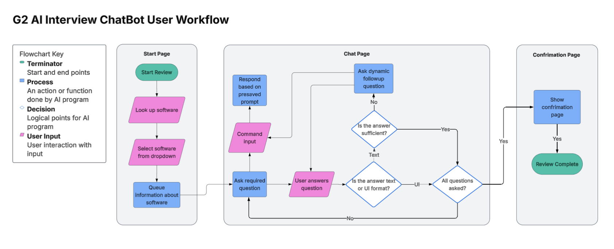
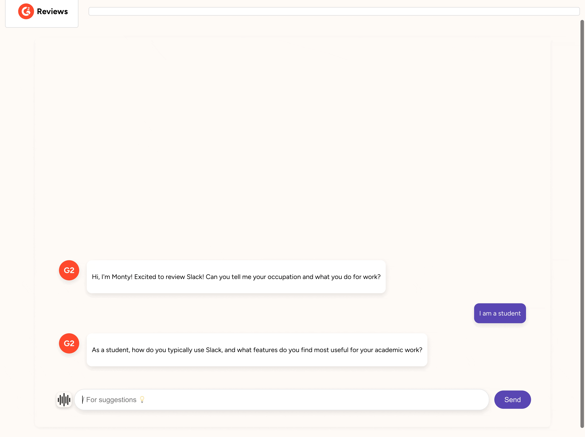
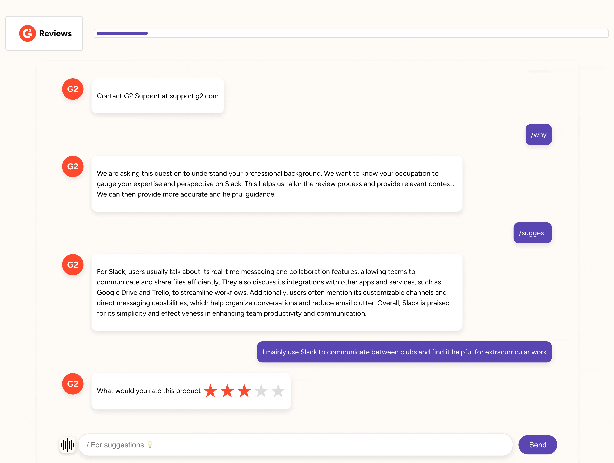

# G2 Review Chatbot


## Table of Contents
- [About](#about)
- [Getting Started](#getting-started)
- [Design](#design)
- [Features](#features)
- [Development Guide](#development-guide)
- [Frequently Asked Questions (FAQ)][#faq]

## About
G2 is the largest and most trusted software marketplace. Individuals and companies use G2 to make smarter software purchasing decisions based on authentic peer reviews from fellow professionals.

Goal of this project was to build a tool utilizing AI that guides users to help them write software reviews to streamline the reviewing process and increase the number of completed reviews. 

The G2 Review Chatbot is an chatbot tool where users can submit a review by pariticpating in an interview with an AI model discussing their experience with the software they would like to review. 

## Getting Started

First clone the repository

```
git clone git@github.com:Weile-Zheng/g2-chatbot.git
```

### Frontend

```
cd client
```

You will need to have [npm](https://www.npmjs.com/) installed on your machine first.

After installing the npm CLI, run

```
npm install
npm run dev
```

Now a development server should be running on localhost:5137

### Backend

```
cd server
```

In the /server/backend/app directory, create .env file with

```
GROQ_API_KEY=
G2_API_KEY=
```

Obtain Groq key [Here](https://console.groq.com/login)

This will allow config.py to correctly load in secrets upon initialization

### Option 1: Docker Compose(Recommended)

First install [Docker Desktop](https://docs.docker.com/desktop/), then in the `/server` directory run:

```
docker compose up
```

Note that the Docker application needs to be open.

### Option 2: Manual Setup(Deprecated)

In order to support nginx proxy setup, all urls in `client/` have been changed to communicate with port 80. Thus this setup will no longer work in local development unless you manually change all url back to 8000, which is not encouraged.

1. Install Redis

```
brew install redis
```

or

```
pip install redis
```

2. Start Redis Server

```
redis-server
```

3. Install Python requirements (from a different terminal)

```
pip install -r requirements.txt
```

4. Start FastAPI server (from a different terminal) in ~/g2-chatbot/server/backend

```
uvicorn app.main:api --reload
```

This setup does not include a Prometheus scraper, but it is fine because that is not the core of the system (at least not in development stage)

These setups may not work as time progresses due to repository/file structure change.

## Design
The G2 Review Chatbot user workflow involves three main components:
1. **Start Page**: this is where users select the software they would like to review

2. **Chatbot Page**: this is where the actual interview takes places and users interact with the chat bot

3. **Confirmation Page**: this is where the user is notified that the interview has completed and where they are able to view the summary of their conversation and review




The website is hosted with the following client and server:
- **Client**:Frontend React code bundled by Vite.
- **Server**:Backend FASTAPI server with database and cache integration using MongoDB and Redis. Performance
monitoring using Prometheus and containerization with Docker.

## Features
- **Search Bar**: ablility to look up software from G2 database to select which software to review
- **Help Comands**: preset commands to help you answer the interview questions
    - */help* guides you to the G2 support team contact
    - */why* lets you know why a specific question is being asked
    - */save* lets you save the chat to go back to later
    - */suggest* gives you a suggested answer to the question being asked
    - */summary* allows you to see a summary of your conversation and what the review looks like currently



- **Dynamic Question Followup**: interview questions are asked organically and are designed to followup on your answers to make it more personalized
- **Process Bar**: tracks the progress of the interview so users know how far they have until they interview is complete and a review is generated
- **UI Interactions**: there are star ratings and sliders that users can use to interact with the chatbot that will add to their overall review of the software



## Development Guide

### Branching

Branch name can start with feat, update, bug, and test, with a short description after "/"

### Examples

-   `feat/add-user-auth`
-   `update/terms-and-conditions`
-   `bug/fix-login-error`
-   `test/improve-test-suite`

### Commits

Commit messages start with one of the main type wrapped around in parenthesis, followed by short description in imperative mood.

#### Types:

-   **feat**: For new features or enhancements.
-   **bugfix**: For fixing bugs.
-   **refactor**: For code changes that does not change any existing overall behavior
-   **chore**: For maintenance tasks like updating dependencies or configuration.
-   **test**: For adding or improving tests or pipelines.
-   **doc**: For changes in documentation.

#### Examples:

-   `(feat) Add login functionality [- Optional Details]`
-   `(doc) Update API documentation [- Optional Details]`

## Frequently Asked Questions (FAQ)

**Q: What is the G2 Review Chatbot?**  
A: The G2 Review Chatbot is an AI-powered tool that helps users write software reviews by guiding them through an interview-style conversation.

**Q: How do I run the project locally?**  
A:  
```bash
git clone git@github.com:Weile-Zheng/g2-chatbot.git
cd client
npm install
npm run dev
```

**Q: Where do I get the required API keys?**  
A:
Groq API key: Groq Console
G2 API key: Provided by G2 after account setup

**Q: Should I use Docker or manual setup?**  
A: Use Docker Compose (recommended). Manual setup is deprecated and may require URL changes.

**Q: How do I fix Redis not starting?**     
A: Ensure Redis is installed (brew install redis or pip install redis) and run redis-server in a separate terminal.

**Q: What are the system requirements?**    
A: You’ll need:
- npm:for the frontend
- Python (with pip) for backend dependencies
- Docker Desktop(recommended setup)
- Redis (if running without Docker)